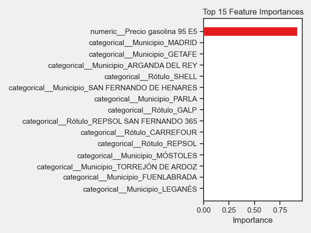

# Fuel Price Analysis and Regression

A Python notebook project exploring fuel prices at petrol stations in Spain, with a focused analysis of stations in Madrid.

The project combines data cleaning, exploratory data analysis and regression experiments to estimate diesel prices from petrol prices and station attributes. English and Spanish notebooks are included.

## What the project covers

- Inspecting dataset structure, data types and missing values.
- Converting prices stored as text with decimal commas into numeric values.
- Applying mean imputation and demonstrating Min-Max scaling.
- Exploring price distributions with histograms and boxplots.
- Measuring the correlation between petrol and diesel prices.
- Generating automated exploratory visualisations with AutoViz.
- Comparing Linear Regression and Random Forest using MAE, RMSE and R².
- Building a multivariable Random Forest pipeline with one-hot encoding for station attributes.
- Visualising feature importance.

## Technologies

Python · pandas · NumPy · Matplotlib · Seaborn · scikit-learn · AutoViz · Jupyter Notebook

## Explore the notebooks

- [English notebook](EN_petrolStationsApp.ipynb)
- [Spanish notebook](ES_petrolStationsApp.ipynb)

The regression experiments use an 80/20 train/test split with `random_state=42`. The multivariable model includes petrol price, sale type, service type, station label and municipality.



## Run locally

The project was run locally with Python 3.12.9 on macOS with Apple Silicon.

Clone the repository:

```bash
git clone https://github.com/rubiwan/PyDataProject.git
cd PyDataProject
```

Create and activate a virtual environment:

```bash
python3.12 -m venv .venv
source .venv/bin/activate
```

On Windows, use `py -3.12 -m venv .venv` and activate it in PowerShell with `.venv\Scripts\Activate.ps1`.

Install dependencies and start Jupyter:

```bash
python -m pip install --upgrade pip
python -m pip install -r requirements.txt
python -m notebook
```

Open either notebook and select **Kernel → Restart Kernel and Run All Cells**. Run Jupyter from the repository root so that relative dataset paths resolve correctly.

### Dependency compatibility

- pandas is pinned to 2.3.3 because AutoViz's `pandas_dq` dependency uses `DataFrame.applymap`, which is unavailable in pandas 3.
- setuptools is pinned to 81.0.0 because the XGBoost version required by AutoViz uses `pkg_resources`.
- XGBoost and AutoViz imports were checked locally. A platform warning from `pip check` remains unresolved; installation on other platforms has not been verified.

## Repository files

| File | Purpose |
| --- | --- |
| `EN_petrolStationsApp.ipynb` | English analysis and modelling notebook |
| `ES_petrolStationsApp.ipynb` | Spanish notebook |
| `gii32_ act1_precios_carburantes_24.csv` | Input dataset |
| `precios_limpios.csv` | Included cleaned-price dataset |
| `feature_importance.png` | Feature-importance chart |
| `requirements.txt` | Pinned versions of direct dependencies |
| `.gitignore` | Excludes local environments and generated development files |

## Scope and limitations

This is an educational analysis of the included dataset. The models estimate diesel prices from station records; they do not forecast future prices.

In the single-variable experiment, mean imputation is performed before the train/test split. This introduces data leakage and should be moved into a training-only preprocessing pipeline before treating the metrics as a reliable evaluation. The multivariable experiment drops incomplete rows and fits its categorical encoder within a pipeline.

The original dataset source and collection date are not documented in this repository yet. Reported relationships apply to the analysed sample and should not be generalised to other regions or dates without further validation.

## Author

[Anabel Díaz](https://github.com/rubiwan)
